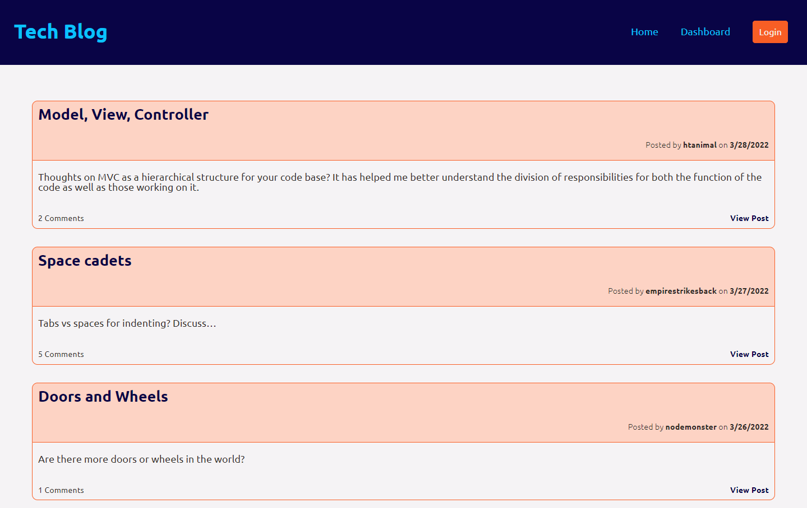
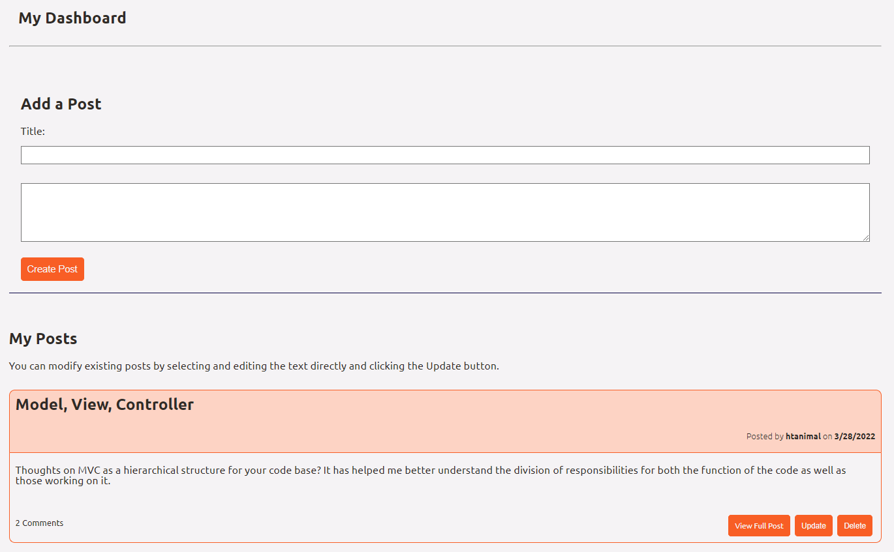

# Tech Blog

## Description
This app is a CMS-style blog site similar to a Wordpress site, where users can publish their blog posts and comment on other developers’ posts as well. It allows guerst users to view posts, but requires sign-up or login in order to create posts or add comments. Once logged in, users can view their dashboard to see and edit their own posts. Users are automatically logged out after 1 minute of inactivity. This app is written in JavaScript, uses Handlebars.js to render dynamic HTML to a page layout and creates, reads, updates and deletes data within a MySQL database. The app is deployed using Node.js on Heroku. 

<strong>Table of Contents</strong>

- [Installation](#installation)
- [Usage](#usage)
- [License](#license)
- [Contributing Guidelines](#contributing-guidelines)
- [Tests](#tests)
- [Languages, Skills and Credits](#languages-skills-and-credits)
- [Screenshots](#screenshots)
- [Questions and Links](#questions-and-links)
- [Details and Learnings](#details-and-learnings)

## Installation
### Local Installation
- Clone the repo.
- Navigate to the folder and run `npm init` followed by `npm install` in order to install the dependencies.
- Be sure to add your MySQL username and password to the .env.EXAMPLE file and rename to .env.
- Using your preferred CLI to execute MySQL, run the schema.sql to create the database.
- Then run `node seeds/seed.js` from the command line in order to populate the database.
- The application can be run by executing `node server.js` into your terminal and navigating to http://localhost:3001/.

## Usage
To use the application sign-up by creating your own user or use any of the usernames and passwords stored in the seeds/userData.json file to login as one of the ficticious users. Note that as a demonstration of session expiration, you will be automatically logged out after 1 minute of inactivity.

## License
Distributed under the **MIT** license.

## Contributing Guidelines
Contributions help our open source community to continue to evolve, and any contributions are greatly appreciated. If you have a suggestion that would improve this code please follow the directions below. I require that any and all changes adhere to the Code of Conduct outlined in the [Contributor Covenant](https://www.contributor-covenant.org/).

 - Fork the repo
 - Create your feature branch
 - Commit your changes
 - Push the branch and open a pull request

> _**Note:** Any contributions are understood to be under the same MIT that covers the project. If this is a concern please contact me._

## Tests
There are currently no tests written for this application.

## Languages, Skills and Credits
- JavaScript
- MySQL
- Handlebars.js
- Sequelize.js
- Node.js
- Dependencies:
  - [express](https://www.npmjs.com/package/express) as a web framework for Node.js.
  - [express-session](https://www.npmjs.com/package/express-session) middleware to create a session variable for persistent logged in status handling
  - [express-handlebars](https://www.npmjs.com/package/express-handlebars) a handlebars view engine for express
  - [bcrypt](https://www.npmjs.com/package/bcrypt) module for password encryption for sign-up and login functionality
  - [mysql2](https://www.npmjs.com/package/mysql2) for executing SQL code
  - [sequelize](https://www.npmjs.com/package/sequelize) to create SQL models and relationships using JS sytnax
  - [dotenv](https://www.npmjs.com/package/dotenv) used to host credentials in an environment file 
  - [connect-session-sequelize](https://www.npmjs.com/package/connect-session-sequelize) SQL session store using Sequelize.js

## Screenshots
Here is a screenshot of the home page and the dashboard page of the application.

## Questions and Links
Please reach out with any questions regarding the application.

The repository in [GitHub](https://github.com/benfok/tech-blog)

The deployed application on [Heroku](https://tech-blog-tl.herokuapp.com/)

## Details and Learnings
- The application is responsive to different screen widths
- When the user is logged in, a logged-in flag appears below the header displaying the username
- Validation exists on all entry fields including email, password and when creating a post
- Comments cannot be added unless a user is logged in. I handled error messages between a mix of browser form functionality and error messages rendering directly to the page. I wanted to avoid using alerts.
- This application uses the hierarchical structure of MVC - Model, View Controller - in order to separate concerns and functionality
- This structure and the use of handlebars.js for templating and rendering dynamic HTML meant a clean and structured code base with great scalability
- The Dashboard shows your own posts, but there is no further profile information or functionality or the ability for users to connect outside of posts
- Some additions that were out of scope for the user story but I considered were:
  - Rendering a 404 page for invalid URLs
  - Improving routing post login. For example, you are unable to comment if you are not logged in, but upon logging in you are not taken back to the post you were viewing
  - Adding an 'edited' flag if a user modifies a post once it has been posted
  - Keyword search functionality

